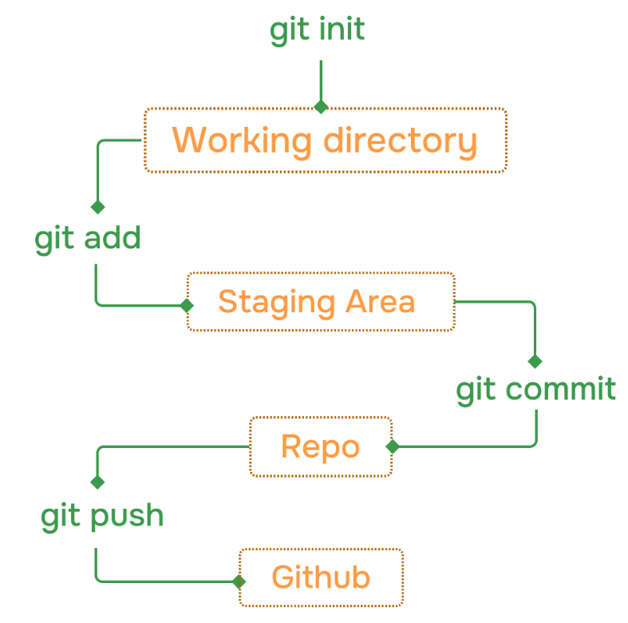

<!-- Part-1 -->
# Git and GitHub basics
### Git:
---
-Git is a version control system that track changes in our code.  
-It allows multiple people to work on a project at the same time.   
- Popular
- free and open source
- fast and scalable
- Track code changes
- Save project history

### Install git
- Download from: [here](https://git-scm.com/install)
after download you can check git version in your command prompt.
> git --version
### Git configuration(First Setup)
> git config --global user.name " your Name"  
> git config --global user.email "yourabc@gmail.com"  
- You can check your git config by
> git config --list
### Repository:
---
-A Git repository(repo) is a storage space where our entire project file and their enitre changes history are kept.  
-Repo is like a ***folder*** that store all changes in our projects.
#### Local Repo:
-Local repo exists on our own conputer.  
-It contains our project files and the full git history.  
-It is created by using
>git init

-Check your git Status:
>git status

-Add files to staging:
- add one file
>git add index.html
- add all file at a time
>git add.

- Commit changes:(commit means saving a snapshot)
>git commit -m "initial commit"

- View commit history
>git log

-Short form
>git log --oneline

### Complete Git flow:

<!-- Part-2 -->

### GitHub:
---
-GitHub is a popular platform use for storing our works. It is a cloud based platform that uses Git to store, manage, and share code.  
-It allows developers to collaborate, track changes adn work together on projects.
-Aleternate of Github is Gitlab and Bitbucket more..

#### Remote Repo:
-It exist on the internet or a server, usually hosted on platforms like:
  - GitHub
  - GitLab
  - Bitbucket       
-Connected using 
>git remote add origin <repository_url>

- Tracked Repo
-Git can tracked these files.

 

- Untracked Repo
  
 -means git can not track these files.
 -Or new files that git doesn't tracked yet.

 

- modified
   
  
- unmodified
  file is unchanged.
   
  
- staged
-file is ready to commit.
### To generate an account on GitHub go to https://github.com

-Create your accound by giving the required details.
 
-Then create your account.
### To create a new repo
-Sign in to your account tap new repo. 
 
-Give your repo name.
 
-Then select public or private according to you.
 
-Add readme.md(here md means markdown) for details.
 
-Then tap create.

### Setting up Git
-It work on our system.
 
-Download VS code.
 
-for Windows (Git Bash)
 
-for mac(Terminal)
 
-For Verify run
>git --version

#### Configuring Git
-To config git we write 
 
>git config --global user.name"my_Name"
   
>git config --global user.email"shaoodell@email.com"  
---

-To see all configuration setting run 
 
>git config --list

### Commit:
-It saved our changes with message.

### Clone:
-Cloning a repository on our local machine
>git clone <---put the link here.....>

### To move inside another folder  
> cd folderName
>
 
-To clear terminal
> clear  
 

-To watch all file list
> ls  

-To watch all file including out hidden file   
> ls -a  

### ADD and Commit
- ***ADD:***
  -adds new or changed files in your working directory to the git staging area.
    
  >git add <-fileName-->  or simply [git add.] (for all file at a time)
   
- ***Commit:***
  >git commit -m "some message"
 
### Push Command
-Upload local repo content to remote repo. 
>git push origin main

## To start with our local repo
- init: used to create a new git repo  
- git remote add origin <---link....>  
- git remote -v (to verify remote)
- git branch (to check branch)
- git branch -M main (to rename branch)
- git push origin main

